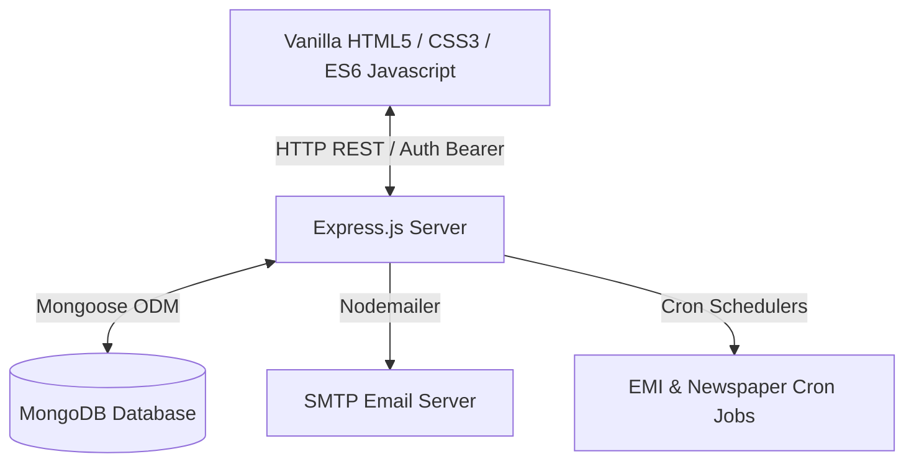

# 📊 FinTrack: Personal Wealth & Investment Strategy Planner

[](#)
[](LICENSE)
[](#)
[](https://nodejs.org/)
[](https://www.mongodb.com/)
[](#)

FinTrack is a premium, production-ready personal wealth management platform inspired by the design principles of professional trading portals like Zerodha Kite and traditional financial publications. It aggregates your portfolios, tracks complex debt structures, manages budgets, and delivers a personalized AI Financial Newspaper directly to your screen and inbox.

---

## 📸 Interface Preview

### 📰 FinTrack Daily Newspaper Desk
A dense, Economic Times / Wall Street Journal styled publication page showcasing localized news based on your assets, featuring bookmarks, manual refresh, and an emergency breaking-news alert banner.


### 📈 Zerodha-Inspired Wealth Dashboard
A modern, minimalist visual cockpit presenting financial health scores, asset distribution, and transaction ledgers.


---

## 🛠️ Architecture Overview

FinTrack is built using a clean, light-weight, and highly-performant decoupled architecture:



- **Frontend:** Vanilla HTML5, modern HSL custom CSS design tokens, dynamic canvas charting (Chart.js), and clean dynamic DOM updates.
- **Backend:** Node.js, Express.js REST APIs, token-based authentication middleware (JWT), and system task schedulers.
- **Database:** MongoDB for persistent transaction logs, goals, user details, debts, credit card limits, and personalized AI articles.

---

## 🚀 Key Features

### 1. 📰 Personalized AI Financial Newspaper
- **Targeted Insights:** Generates localized financial digests tracking only tickers in your holdings, watchlist, or future buy list.
- **Emergency Alert System:** Automatically bypasses the standard 12-hour refresh cycle to flash breaking news banners for critical market events (e.g. regulatory actions, data breaches, earnings misses).
- **Automated Delivery:** Automatically generates and emails the daily dispatch directly to your inbox every morning at **09:00 AM local time**.

### 2. 💳 Credit Card & Debt Management
- **Credit Limit & Utilization Tracking:** Visualizes credit limit usage, automatically calculating remaining credit space and utilization percentages.
- **Financial Calculation Engine:** Built-in Simple and Compound Interest calculation engine to compute total payable interest, amortized monthly EMIs, and generate full amortization schedules.
- **Historical payment logs:** Automatically breaks down every EMI/manual payment into exact principal vs. interest portions and logs them.

### 3. 🎯 Savings Goals & Suggestions
- **Dynamic Allocation Planner:** Uses age select ranges, risk profiles, and wealth goals to dynamically compute optimal asset allocations across Equity, Mutual Funds, Commodities, Real Estate, and Bonds.
- **Interactive Breakdowns:** Instantly toggle collapsible asset classes to inspect sub-asset distributions.

---

## ⚙️ Environment Variables

Create a `.env` file in the `backend/` directory with the following variables:

```ini
# Server Configuration
PORT=5000
MONGO_URI=mongodb://localhost:27017/fintrack
JWT_SECRET=your_jwt_super_secret_key

# Email Integration (Nodemailer SMTP)
EMAIL_HOST=smtp.mailtrap.io
EMAIL_PORT=2525
EMAIL_USERNAME=your_smtp_username
EMAIL_PASSWORD=your_smtp_password
EMAIL_FROM=noreply@fintrack.com
EMAIL_ENABLED=true
```

---

## 📦 Installation & Setup

### Prerequisites
- Node.js (v18+)
- MongoDB Community Server (running locally on port 27017)

### Steps

1. **Clone the repository:**
   ```bash
   git clone https://github.com/your-username/fintrack.git
   cd fintrack
   ```

2. **Setup Backend:**
   ```bash
   cd backend
   npm install
   # Configure your .env file here
   npm start
   ```

3. **Open Frontend:**
   The backend serves frontend pages statically from the root directory. Navigate to:
   ```
   http://localhost:5000/index.html
   ```

---

## 🗺️ Future Roadmap

- [ ] **Interactive Amortization Graphs:** Interactive visual SVG charts rendering principal paydown timelines.
- [ ] **Multi-Currency Support:** Dynamically fetch exchange rates to localize international portfolio holdings.
- [ ] **Live Plaid Integration:** Seamless bank feeds syncing transaction ledgers in real-time.
- [ ] **AI Advisor Voice Chat:** Voice assistance summarizing daily newspaper briefs.

---

## 🤝 Contribution Guidelines

We welcome contributions to FinTrack! To get started:
1. Fork this repository.
2. Create a feature branch: `git checkout -b feature/your-awesome-feature`.
3. Commit your changes: `git commit -m 'Add awesome feature'`.
4. Push to the branch: `git push origin feature/your-awesome-feature`.
5. Open a Pull Request.

Please ensure your code follows standard JavaScript formatting guidelines and compiles cleanly without errors.

---

## 📄 License
This project is licensed under the MIT License. See the [LICENSE](LICENSE) file for details.
